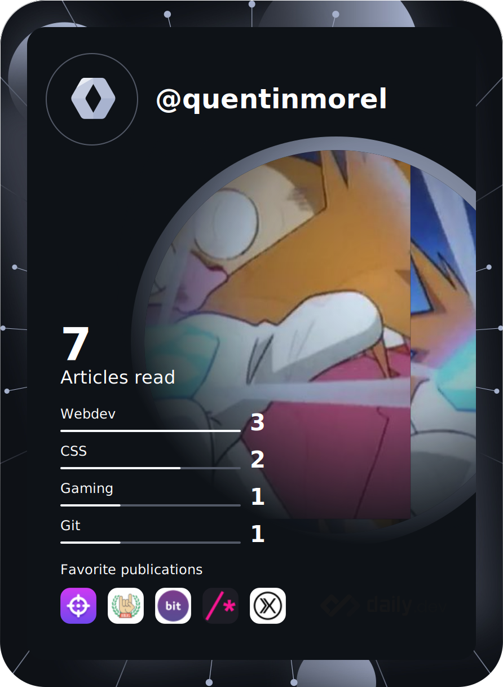

<h1 align="center">Hello there </h1>

<h3>About Me</h3>

<!--

    

-->

    <h4>Who am I❓</h4>
    <ul>
        <li>Hi, I am a French 🇫🇷 gameplay developer 🎮</li>
        <li></li>
    </ul>
    <h4>Current projects 🔭</h4>
    <ul>
        <li><a href="https://github.com/Im-Rises/NesEmulator">NesEmulator 👾</a></li>
        <li><a href="https://github.com/Im-Rises/GalaxySimulator">Galaxy Simulator 🌠</a></li>
        <li>
My Engine 🚀
</li>
    </ul>

    <h3>Git Stats</h3>
    
    

    <h3>GitHub Profile Trophies 🏆</h3>
    

### Most used languages

    

<!--
[//]: # (  )
[//]: # (  )

[//]: # (
)

## My games

- Lord of the platformers Game [itch.io](https://im-rises.itch.io/platformer-king) 👾
- Pac-Man Game [itch.io](https://im-rises.github.io/PacManUnity/) 👾
- Last Exodus Game [itch.io](https://fromiel.itch.io/le-dernier-exode) 👾
- DrumVR [itch.io](https://im-rises.github.io/DrumVR/)
- Scraft Game [itch.io](https://pordrack.itch.io/scraft) 👾
- Fortress Siege [itch.io](https://alshkor.itch.io/fortress-siege) 👾

## My applications

- [Game of Life](https://im-rises.github.io/GameOfLife)

## My emulators

- [GameBoyEmulator](https://im-rises.github.io/GameBoyEmulator)
- [Space Invaders Arcade Emulator](https://im-rises.github.io/space-invaders-arcade-emulator-tauri)
- [Nes Emulator](https://im-rises.github.io/NesEmulator) WIP

## My websites 💬

- [My Portfolio](https://im-rises.github.io) 📫
- [Online Emotion Recognition AI](https://im-rises.github.io/emotion-recognition-website) 😄
- [Zalgo Text Generator](https://im-rises.github.io/zalgo-generator/) 💬
- [Image Ascii Convertissor](https://im-rises.github.io/image-ascii-art-website/)
- [Video Ascii Player](https://im-rises.github.io/video-stream-ascii-player/) 🤔
- [Video Ascii Webcam](https://im-rises.github.io/video-stream-ascii-webcam/) 🤔
- [Cube ASCII React](https://im-rises.github.io/cube-ascii-react-website/)
- [Particle Simulator React p5js](https://im-rises.github.io/particle-simulator-react-p5-website) 🌟
- [Particle System Webgl](https://im-rises.github.io/particle-system-webgl)
- [Physical Engine Webgl](https://im-rises.github.io/physical-engine-webgl)
- [Particle Simulator WebGL](https://im-rises.github.io/particle-simulator-webgl) 🌟
- [Space Invaders Arcade Emulator Website](https://im-rises.github.io/space-invaders-arcade-emulator-website) 👾
- [Pokédex React](https://im-rises.github.io/pokedex-react)

## My packages

- [particle-simulator-react-p5](https://www.npmjs.com/package/particle-simulator-react-p5)
- [video-stream-ascii](https://www.npmjs.com/package/video-stream-ascii)
- [image-ascii-art](https://www.npmjs.com/package/image-ascii-art)
- [nbody-simulator-react-p5](https://www.npmjs.com/package/nbody-simulator-react-p5)
- [nbody-simulator-barnes-hut-react-p5](https://www.npmjs.com/package/nbody-simulator-barnes-hut-react-p5)
- [cube-ascii-react](https://www.npmjs.com/package/cube-ascii-react)
- [zalgo-generator](https://www.npmjs.com/package/zalgo-generator)
- [space-invaders-arcade-emulator](https://www.npmjs.com/package/space-invaders-arcade-emulator)

## How to reach me 📫

## Currently learning 🌱

- Game Development

  

<!--
### Operating systems

    
    
    

-->

<!--

    
    
    
    
    
    
    
    
    
    
    
    
    
    
    
    
    
    
    
    
    
    
    
    

-->

<!--

https://github.com/anuraghazra/github-readme-stats
https://dev.to/envoy_/150-badges-for-github-pnk
https://github.com/ryo-ma/github-profile-trophy
https://github-readme-streak-stats.herokuapp.com/demo/?user=Im-Rises&theme=dark&hide_border=true&date_format=&locale=en&properties=background
https://www.profileme.dev/create-profile
https://daily.dev/blog/adding-the-daily-devcard-to-your-github-profile

## To do
Here are some ideas to get you started:

- 🔭 I’m currently working on ...
- 🌱 I’m currently learning ...
- 👯 I’m looking to collaborate on ...
- 🤔 I’m looking for help with ...
- 💬 Ask me about ...
- 📫 How to reach me: ...
- 😄 Pronouns: ...
- ⚡ Fun fact: ...
- ♾️
-->
